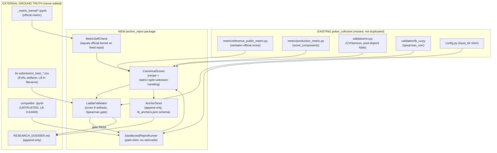

# Design Document

## Overview

This spec builds the tooling and validators that turn REAL code with KNOWN real leaderboard scores into REAL `(local-holdout-AP, real-LB)` anchors. It is governed end-to-end by the workspace `reverse-engineering-accountability` contract: external judge only, pre-register the bar, honest nulls are results, no extrapolation, state the uncertainty, one change per submission.

### The load-bearing fact this design is built around (MEASURED, not assumed)

The nine `submission_best_*.csv` artifacts are **EVAL submissions**. Their `pair_id` sets are the ~112,540 evaluation pairs, and their scores are **PRIVATE-leaderboard numbers** Kaggle computed against labels we do not hold. The dev labels we DO hold (`development_labels.csv`, 1,860 confirmed pairs) are a **disjoint** set.

This was verified directly during design, not assumed:

```
submission_best_044519.csv pair_ids: 112,540
development_labels.csv pair_ids:        1,860
intersection:                               0
```

**Consequence (the honest constraint, contract Rules 1 & 9):** the canonical local scorer **cannot score an eval artifact CSV against dev labels** — there is nothing to score, the pair sets do not overlap. Therefore:

- No local metric can reproduce any absolute LB number. That is impossible and is stated as impossible, never faked (Req 2.4). The existing `poker_collusion.experiments.gate_a_verify_floor` already encodes this scope note for the 0.44519 floor and is the template this design follows.
- A submission artifact's local holdout AP is obtained by **re-running the recipe that produced it on the dev holdout** (the PU-stress table-disjoint split), then scoring those dev-pair predictions with the official metric — exactly how the recorded floor `holdout_ap = 0.3839` was produced. The frozen eval CSV is used for **integrity/scoreability** checks, not for numeric dev scoring.
- The external-judge check is therefore **relative and rank-based**: does the canonical local holdout AP order the artifacts the same way their real LB scores do (Spearman)? An absolute match is out of scope by construction.

### What this spec delivers

1. A **canonical local scorer** (single, auditable recipe) built on the existing `poker_collusion` metric/CV, plus a self-check against the official metric kernel.
2. A **ladder-validation harness** that scores the known-LB ladder under the canonical scorer and measures rank-tracking against the real LB order, gated by a pre-registered Spearman bar — run and trusted BEFORE any competitor code.
3. A **sandboxed reproduction runner** that executes UNTRUSTED competitor notebooks against local data behind a path shim with no unreviewed network/credential access.
4. An **append-only anchor store** consistent with the parent harness's `lb_anchors.json` schema, plus append-only dossier reporting.

### Build order (mandated, Req 1→2→3)

```
(1) tooling + canonical scorer + official-metric self-check
        │
        ▼
(2) validate the scorer against OUR OWN nine known-LB artifacts  ← external-judge gate
        │   (rank-tracking Spearman bar)                            trust earned here
        ▼
(3) reproduce the 0.64469 competitor notebook as a NEW anchor    ← only if (2) passed
```

A scorer that cannot rank-track our own known ladder is not trusted to anchor anyone else's code. If step 2 produces a null (no rank-tracking), that null is the deliverable and step 3's anchor is recorded but flagged untrusted (Req 2.3).

## Architecture

### Component map (all under the existing `poker/` tree, reusing `poker_collusion`)



### Placement decisions (Req 1.6, 6)

- New code lives as a package `poker/poker_collusion/anchor_repro/` (or a sibling `poker/anchor_repro/` that imports `poker_collusion`). It **imports** `poker_collusion.metric.*`, `poker_collusion.validation.cv`, and `poker_collusion.validation.lb_cv.spearman_corr`. It does **not** re-implement the metric, the CV split, or the Spearman statistic — all three already exist and are reused verbatim.
- The official metric already has a verbatim local copy at `poker_collusion/metric/reference_public_metric.py`, whose docstring names its source kernel `data/poker/_metric_kernel/slash-poker-competition-metric.ipynb`. Req 1.2/1.3 (a permitted local copy of the official metric) is therefore already satisfied by an existing file; the self-check (Req 1.4) re-verifies it against the kernel rather than creating a second copy.

### Dependency management (Req 1.1)

The lowest-friction competitor notebook (`detecting-collusive-value-transfer-in-6-max-poker.ipynb`) needs only `polars` beyond the installed `pandas/numpy/scikit-learn/xgboost`. The added dependency and its pinned version are recorded in `poker/pyproject.toml` / a `anchor_repro/requirements.lock` so setup is repeatable. The two `lightgbm`+`catboost` notebooks are explicitly out of scope for step 3 and, if attempted, follow the same recorded-dependency + BLOCKED-on-missing-dep path.

## Components and Interfaces

### 1. CanonicalScorer (Req 1.2, 1.6, 2.5, 2.6)

The single agreed local scoring recipe under which **every** anchor (ours and competitors') is measured, so anchors are mutually comparable. This directly inherits the AP-definition-consistency lesson from the retired recalibration spec.

The recipe is a frozen, recorded tuple: `(metric_fn, split, unknown_label_handling, ap_definition)`.

```python
@dataclass(frozen=True)
class ScoringRecipe:
    recipe_id: str                 # e.g. "canonical_v1"
    metric: str = "reference_public_metric.score"   # the verbatim official metric
    primary_ap_component: str = "pair_ap"   # PRIMARY rank-tracked quantity (metric is 70% PairAP)
    secondary_component: str = "combined"   # SECONDARY diagnostic: full official combined score
    split: str = "table_disjoint_holdout_40pct"      # the eval-mimic dev holdout
    unknown_handling: str = "pu_confirmed_only"       # unknowns never scored as negatives
    holdout_seed: int = 404        # config.Seeds.cv_split (deterministic)

@dataclass(frozen=True)
class CanonicalScore:
    """Both local scores a single scoring produces under the canonical recipe."""
    pair_ap: float          # PRIMARY gate quantity (the metric's 70% PairAP intermediate)
    combined: float         # SECONDARY diagnostic: 0.70*PairAP + 0.20*EvidenceMAP@5 + 0.10*BehaviorMAP
    components: ScoreComponents   # full breakdown (pair_ap, evidence_map, behavior_map)

class CanonicalScorer:
    def __init__(self, recipe: ScoringRecipe, config: PipelineConfig): ...

    def score_dev_predictions(self, dev_predictions: pd.DataFrame) -> CanonicalScore:
        """Score a submission whose pair_ids ARE dev holdout pairs, using the
        official metric via CVHarness/build_fold_solution (PU-correct). Returns BOTH
        local scores from the SAME reference_public_metric evaluation: `pair_ap` (the
        metric's PairAP intermediate, the PRIMARY gate) and `combined` (the full
        official number the metric returns, a SECONDARY diagnostic). One scorer pass
        yields both — they are never computed from different splits or recipes.
        Raises explicitly (never returns a number) if the prediction pair-ids do not
        cover the dev holdout pair set — see the coverage-mismatch guard below."""

    def integrity_report(self, eval_artifact: pd.DataFrame) -> IntegrityReport:
        """Scoreability/integrity of a frozen EVAL artifact (hash, row count,
        pair-set-equals-sample, non-degenerate ranking). Mirrors gate_a_verify_floor.
        Does NOT attempt a dev score of the eval artifact (impossible: disjoint sets).
        Surfaces the disjoint-set sizes explicitly (coverage-mismatch guard, Change B)."""
```

- `score_dev_predictions` reuses `build_fold_solution` and `score_components` from `validation/cv.py` / `metric/production_metric.py`, so PU unknown-handling (unknowns never materialized as negatives) is inherited, not reinvented.
- The **same** `reference_public_metric.score` evaluation that returns the combined number computes `pair_ap` as its 70%-weighted intermediate; the scorer surfaces **both** so the primary gate (PairAP) and the secondary diagnostic (combined) come from one identical evaluation, not two divergent recomputations. `CanonicalScore.pair_ap` is the anchor's `local_holdout_ap`; `CanonicalScore.combined` is recorded alongside it.
- The recipe object is serialized into every anchor's provenance so the recipe is auditable and identical across ours-vs-competitor anchors (Req 2.5, 2.6, 3.5).

### 2. MetricSelfCheck (Req 1.4)

Before the scorer judges anything, verify the local official-metric copy equals the metric kernel's own expected output on a known input.

```python
def verify_metric_against_kernel() -> SelfCheckResult:
    """Load the fixed (solution, submission, expected_score) example embedded in
    slash-poker-competition-metric.ipynb; assert reference_public_metric.score(...)
    equals the kernel's expected score to full float tolerance. FAIL => release
    blocker; the scorer refuses to run."""
```

If the kernel exposes no embedded example, the self-check constructs a small fixed solution/submission pair, scores it with the kernel's own `score()` cell (extracted) and with `reference_public_metric.score`, and asserts equality. Either way the check is a hard gate on trusting the scorer.

### 3. LadderValidator (Req 2.1–2.6) — the external-judge gate

```python
@dataclass(frozen=True)
class LadderPoint:
    config_id: str          # from artifact filename
    real_lb: float          # parsed from submission_best_<score>.csv (external judge)
    local_pair_ap: float    # PRIMARY: canonical scorer PairAP, recipe recorded
    local_combined: float   # SECONDARY: full official combined score, same recipe/pass
    recipe_id: str
    source: str             # dossier section / artifact sha256

@dataclass(frozen=True)
class MetricRankTracking:
    """Rank-tracking result for ONE metric (PairAP or combined)."""
    metric_name: str        # "pair_ap" (primary) | "combined" (secondary)
    spearman: float
    threshold: float
    passed: bool            # spearman >= threshold AND strictly > 0.0
    verdict: str            # "TRUSTED" | "WEAK" | "NULL"

@dataclass(frozen=True)
class RankTrackingVerdict:
    n_points: int
    ci_note: str            # significance / CI caveat for n=9
    primary: MetricRankTracking     # PairAP — the pre-registered PRIMARY gate
    secondary: MetricRankTracking   # combined official score — SECONDARY diagnostic
    agree: bool             # do primary and secondary agree on the pass/verdict?
    disagreement_note: str  # if not agree: recorded as a first-class finding, NOT reconciled
    # Overall trust is decided by `primary` (PairAP). `secondary` is reported alongside
    # regardless of whether it agrees — no cherry-picking (contract Rules 2 & 12).
    passed: bool            # == primary.passed (the gate verdict is the PRIMARY gate)
    verdict: str            # == primary.verdict
    message: str

class LadderValidator:
    def score_ladder(self, artifacts: list[Path]) -> list[LadderPoint]: ...
    def rank_tracking(self, points: list[LadderPoint]) -> RankTrackingVerdict:
        """Compute Spearman rank-tracking against real_lb for BOTH metrics:
        primary = spearman_corr(local_pair_ap, real_lb),
        secondary = spearman_corr(local_combined, real_lb).
        Reuses poker_collusion.validation.lb_cv.spearman_corr for both. The overall
        gate verdict is the PRIMARY (PairAP) verdict — pre-registered before results
        are seen (contract Rule 2). The SECONDARY combined verdict is always reported
        too; if the two DISAGREE, `agree=False` and `disagreement_note` records it as a
        first-class finding for the dossier — it is NOT reconciled away or cherry-picked
        (contract Rule 12 / no validation-theater)."""
```

The gate uses the **pre-registered bar** (see Correctness Properties / the gate section below). A null verdict (`NULL`) on the PRIMARY (PairAP) gate is a first-class result, appended to the dossier, and it blocks trusting the scorer for anchoring (Req 2.3) — step 3's anchor is still recorded but flagged untrusted. Both the PairAP verdict and the combined-score verdict are recorded every run; a PairAP/combined disagreement is itself a recorded finding, never hidden.

### 4. SandboxedReproRunner (Req 1.5, 3.1, 3.3) — untrusted-code execution

ALL notebook content is treated as untrusted **regardless of source** — no trusted-source exemption, no pre-vetting bypass.

```python
@dataclass(frozen=True)
class ReproResult:
    notebook: str
    status: str             # "RUNNING" | "SUCCEEDED" | "BLOCKED"
    submission_path: Optional[Path]
    failure_stage: Optional[str]   # "deps" | "data_path" | "compute" | "runtime"
    failure_detail: Optional[str]
    dependency_manifest: dict
    data_path_manifest: dict

class SandboxedReproRunner:
    def read_as_untrusted(self, notebook: Path) -> NotebookManifest:
        """Parse cells WITHOUT executing; extract declared deps + data-path reads;
        flag any network/subprocess/credential/filesystem-escape calls for review."""

    def run(self, notebook: Path, *, local_data_dir: Path, timeout_s: int) -> ReproResult:
        """Execute behind: (a) an explicit path shim mapping the notebook's data-root
        discovery to poker/data/poker; (b) network egress disabled; (c) no credential
        env vars exposed; (d) a working dir jail + wall-clock timeout. Captures the
        emitted submission.csv on success."""
```

Sandboxing approach is detailed in the Security section. The status may pass through `RUNNING` while a failure is diagnosed and only then flip to `BLOCKED` (Req 3.3) — it need not flip at the instant of first error.

### 5. AnchorStore (Req 3.5, 4.2) — append-only

```python
class AnchorStore:
    def __init__(self, path: Path):  # lb_anchors.json (parent-harness schema)
    def load(self) -> list[Anchor]: ...
    def append(self, anchor: Anchor) -> None:
        """Append-only. Refuses to edit/delete an existing anchor. Refuses to append
        a non-verified anchor as verified=true. Only a real external LB may back
        real_lb. Writes are atomic (temp file + rename)."""
```

The store is consistent with the existing `.kiro/specs/poker-collusion-detection/lb_anchors.json` schema so the parent `poker-layered-tuning` harness can consume it. Anchors carry provenance noting reproduced-competitor origin and the canonical `recipe_id`.

## Data Models

### Anchor tuple (extends the existing `lb_anchors.json` schema)

The parent schema fields are preserved verbatim; this spec adds `recipe_id` inside `source`/provenance so anchors remain schema-compatible while recording the canonical scorer used.

```json
{
  "config_id": "competitor_pu_value_transfer_064469",
  "real_lb": 0.64469,
  "measured_drift": null,
  "holdout_ap": 0.0000,
  "source": "reproduced competitor notebook detecting-collusive-value-transfer-in-6-max-poker.ipynb; recipe_id=canonical_v1; nb_sha256=<hash>; ladder gate verdict=<TRUSTED|NULL>",
  "verified": true
}
```

Field semantics (unchanged from parent, with this spec's usage):

| field | meaning in this spec |
|---|---|
| `config_id` | stable id of the scored configuration (our ladder id, or reproduced-competitor id) |
| `real_lb` | the REAL LB number — from artifact filename (ours) or the notebook's claimed 0.64469 (competitor). External judge only. |
| `measured_drift` | adversarial dev-vs-eval AUC when available; `null` for competitor repro if not computed |
| `holdout_ap` | canonical-scorer local holdout **PairAP** under `recipe_id` — the PRIMARY relative quantity that must rank-track `real_lb`. The full combined official score is recorded alongside as a SECONDARY diagnostic. |
| `source` | provenance: artifact sha / notebook sha, dossier section, and the `recipe_id` used |
| `verified` | `true` only when confirmed by an external judge (contract Rule 1) |

### ScoringRecipe (new, serialized into provenance)

`(recipe_id, metric, primary_ap_component, secondary_component, split, unknown_handling, holdout_seed)` as defined above. Frozen and identical across all anchors produced by this spec so ours-vs-competitor anchors never mix regimes (Req 2.6). The recipe names PairAP as the primary rank-tracked component and the full combined official score as the secondary diagnostic; both come from one `reference_public_metric.score` pass.

### CanonicalScore (new)

`(pair_ap, combined, components)` — the two local scores plus the full `ScoreComponents` breakdown, all produced by a SINGLE canonical scoring pass. `pair_ap` feeds the primary gate and the anchor's `holdout_ap`; `combined` is the secondary diagnostic.

### LadderPoint / MetricRankTracking / RankTrackingVerdict

As defined in the LadderValidator interface. `LadderPoint` is the `(real_lb, local_pair_ap, local_combined)` triple per artifact with recipe + provenance. `MetricRankTracking` is the per-metric Spearman + threshold + verdict for ONE of the two metrics. `RankTrackingVerdict` bundles the PRIMARY (PairAP) and SECONDARY (combined) `MetricRankTracking` results, the n=9 significance caveat, and an `agree`/`disagreement_note` pair recording whether the two metrics agree. Overall `passed`/`verdict` mirror the PRIMARY (PairAP) result; the SECONDARY is reported regardless (no cherry-picking).

### Why dual-metric is a LIVE question, not a pre-answered null (MEASURED)

The real LB score is the **combined official metric** `0.70*PairAP + 0.20*EvidenceMAP@5 + 0.10*BehaviorMAP`, but the ladder is rank-tracked on PairAP. Whether the combined metric rank-tracks the same way as PairAP alone depends on whether the behavior/evidence components vary across the ladder. They do:

> **MEASURED (inspected on the eval artifacts).** The nine eval artifacts split into exactly two behavior profiles — six artifacts (018462, 019029, 019281, 032580, 033131, 037063) share `{none:101768, directed_transfer:5262, coordinated_isolation:4265, other_coordination:1071, soft_play:174}`; three artifacts (039372, 041289, 044519) share `{none:103537, directed_transfer:3630, soft_play:3133, coordinated_isolation:2240}`. Evidence non-empty cell counts are identical (562671) across all nine. Because the behavior component is NOT constant across the ladder, the combined metric can rank-track differently than PairAP alone, so scoring both is a live question, not a pre-answered null.
>
> **Caveat (contract Rule 9 — state the uncertainty).** Ladder AP is obtained by re-running each recipe on the dev holdout (the eval CSVs cannot be dev-scored — disjoint pairs), so this behavior variation is evidence the recipes' behavior/evidence heads differ. It is a property MEASURED on the frozen eval artifacts, not a projection.

Consequences pre-registered here (contract Rule 2, before results are seen):

- **PRIMARY gate: PairAP.** The official metric is 70% PairAP and the canonical scorer already targets PairAP; PairAP is the gate that decides trust. This is fixed before any ladder is scored.
- **SECONDARY diagnostic: combined score.** Reported every run regardless of whether it agrees with PairAP.
- **Disagreement is a finding, not a defect.** If PairAP and combined disagree on rank-tracking, that disagreement is recorded verbatim in the dossier as a first-class result — not reconciled away, not cherry-picked toward whichever looks better (contract Rules 1, 2, 12).

### Known-LB ladder (the nine external-judge points)

Parsed from filenames; `real_lb = int(score_digits)/1e5`:

```
018462→0.18462  019029→0.19029  019281→0.19281  032580→0.32580
033131→0.33131  037063→0.37063  039372→0.39372  041289→0.41289
044519→0.44519
```

The dossier records the fuller real trajectory (0.05713 → … → 0.44519) with documented regressions; those regressions matter for interpreting rank-tracking honestly (a non-monotone real trajectory means perfect Spearman is not expected).

## Correctness Properties

*A property is a characteristic or behavior that should hold true across all valid executions of a system-essentially, a formal statement about what the system should do. Properties serve as the bridge between human-readable specifications and machine-verifiable correctness guarantees.*

### Property 1: Canonical scorer determinism

*For any* dev-prediction frame scored twice under the same `ScoringRecipe`, the `CanonicalScorer` SHALL return an identical `CanonicalScore` — identical `pair_ap`, identical `combined`, and identical `ScoreComponents` (both local scores are a deterministic function of inputs + recipe, with fixed seed, and both are produced by the same single metric pass).

**Validates: Requirements 1.2, 2.5, 2.6**

### Property 2: Scorer–recipe consistency across artifacts

*For any* set of artifacts scored to produce anchors, every resulting anchor SHALL record the SAME `recipe_id`; scoring the same dev-prediction frame under two anchors' recorded recipes SHALL yield the same local holdout AP (no cross-regime mixing between our-artifact and competitor anchors).

**Validates: Requirements 2.5, 2.6, 3.5**

### Property 3: Official-metric equivalence (self-check)

*For any* fixed (solution, submission) input from the metric-kernel example, the local `reference_public_metric.score` SHALL equal the kernel's own score to full float tolerance; if not, the scorer SHALL refuse to run.

**Validates: Requirements 1.2, 1.4**

### Property 4: Rank-tracking gate monotonicity (both metrics)

*For any* ladder of `(real_lb, local_pair_ap, local_combined)` points, EACH per-metric `MetricRankTracking.passed` flag (primary PairAP and secondary combined) SHALL be a monotone function of that metric's local ordering agreement with the real-LB ordering: making one artifact's local value move strictly toward its real-LB rank never decreases that metric's Spearman, and a metric is marked `TRUSTED` only when `spearman >= threshold` AND `spearman > 0.0`. The overall `RankTrackingVerdict.passed`/`verdict` SHALL equal the PRIMARY (PairAP) metric's result.

**Validates: Requirements 2.2, 2.3**

### Property 5: Impossibility guard + coverage-mismatch guard (no fabricated absolute match)

*For any* eval artifact and dev-label set whose pair-id sets are not equal (empty intersection, or any missing/extra pair), the scorer SHALL NOT return an absolute LB-score reproduction: it SHALL either pre-check the pair-id intersection and refuse, or surface the official metric's own `ParticipantVisibleError` coverage-mismatch raise — never a silent zero or a fabricated number. In both paths the diagnostic SHALL name the disjoint-set sizes (how many pair-ids are missing and how many are extra). Any absolute-match claim SHALL be rejected and only a relative rank-tracking claim is permitted.

**Validates: Requirements 2.4, 4.1**

### Property 6: Append-only anchor-store integrity

*For any* sequence of `append` operations on the `AnchorStore`, every previously stored anchor SHALL remain byte-unchanged, no anchor SHALL be deleted, and an anchor SHALL NOT be persisted with `verified=true` unless backed by a real external LB value.

**Validates: Requirements 3.5, 4.2**

### Property 7: Filename→real-LB parse round-trip

*For any* artifact filename `submission_best_<d>.csv`, the parsed `real_lb` SHALL satisfy `real_lb == int(d)/1e5` and re-formatting `real_lb` SHALL reproduce `<d>` (the external-judge score is read from the filename without distortion).

**Validates: Requirements 2.1, 4.1**

### Property 8: Dual-metric verdict is always reported, never cherry-picked

*For any* scored ladder, the `RankTrackingVerdict` SHALL contain BOTH the primary (PairAP) and the secondary (combined) `MetricRankTracking` results; the overall `passed`/`verdict` SHALL equal the primary (PairAP) result independent of the secondary result (the primary gate is pre-registered and cannot be swapped for the secondary because it looks better), and whenever the two metrics disagree on their pass flag the verdict SHALL set `agree=False` and record a non-empty `disagreement_note` (the disagreement is surfaced, never dropped).

**Validates: Requirements 2.2, 2.3, 4.1, 4.2**

## Pre-registered rank-tracking gate

Pre-registering the bar is contract Rule 2. The gate is fixed **before** the ladder is scored and recorded in the dossier.

- **Held-out judge:** the real LB order of the nine artifacts (external judge; the only ground truth).
- **PRIMARY metric (the gate): PairAP.** Spearman rank correlation between canonical `local_pair_ap` and `real_lb`. Pre-registered as the gate because the official metric is 70% PairAP and the canonical scorer already targets it. This choice is fixed BEFORE the ladder is scored (contract Rule 2).
- **SECONDARY metric (diagnostic): the full combined official score.** Spearman between canonical `local_combined` and `real_lb`, reported every run regardless of whether it agrees with the primary. Both statistics use the existing `poker_collusion.validation.lb_cv.spearman_corr`. If primary and secondary disagree, the disagreement is recorded verbatim as a first-class finding and NOT reconciled or cherry-picked (contract Rules 2, 12).
- **Contract-minimum bar (Req 2.2), applied per metric:** `spearman > 0.0` strictly. Exactly 0.0 or negative ⇒ NULL for that metric; the PRIMARY (PairAP) NULL means the scorer is NOT trusted.
- **RECOMMENDED operational bar (pre-registered as the actual gate), applied to the PRIMARY PairAP metric:** `spearman >= 0.7`, reported with an explicit significance/CI caveat. Rationale: with only n=9 points, a small positive Spearman is indistinguishable from noise (a near-zero correlation over nine points carries a wide confidence interval and a non-significant p-value). Requiring ≥ 0.7 means the local metric orders the ladder *strongly* like the real LB, which is what "trustworthy relative judge" must mean before we let it anchor competitor code. The same 0.7 operational bar is computed and reported for the SECONDARY combined metric too, but the SECONDARY never overrides the PRIMARY. The dossier entry records both metrics, both bars, and states the n=9 uncertainty explicitly (contract Rule 9).
- **Verdict handling (decided by the PRIMARY PairAP metric; the SECONDARY combined result is always reported alongside):**
  - PairAP `spearman >= 0.7` → `TRUSTED`; proceed to step 3, and the step-3 anchor is a genuine new external point.
  - PairAP `0.0 < spearman < 0.7` → **WEAK / not trusted at the operational bar**; report as such, record the number and its CI, do not claim a trustworthy judge; step 3 may still run for information but its anchor is flagged `scorer_trusted=false`.
  - PairAP `spearman <= 0.0` → `NULL` (contract-minimum fails); the scorer is not a relative judge and this null is the deliverable (Req 2.3).
  - **PairAP vs combined disagreement:** whenever the two metrics land on different verdict tiers, `agree=False` is recorded with a `disagreement_note` — a first-class finding in the dossier (e.g. "combined rank-tracks but PairAP does not, so the behavior/evidence heads are carrying the LB order"). It is never smoothed over or used to cherry-pick a passing metric.

## Error Handling

### Reproduction runner: BLOCKED vs partial (Req 3.3, contract Rule 9)

| Failure stage | Detection | Recorded status | Reported |
|---|---|---|---|
| missing dependency | import/parse of declared deps fails | `RUNNING`→`BLOCKED` | exact missing package + version needed |
| data path | path shim cannot resolve a required local file | `RUNNING`→`BLOCKED` | which file/path the notebook expected |
| compute limit | wall-clock timeout / OOM | `RUNNING`→`BLOCKED` | stage reached + resource that ran out |
| runtime error | uncaught exception in a cell | `RUNNING`→`BLOCKED` | cell index + traceback summary |
| success | `submission.csv` emitted with valid schema | `SUCCEEDED` | path to captured submission |

Reproduction is **never** reported as partially successful: it is either `SUCCEEDED` (submission captured and scoreable) or `BLOCKED` with the exact stage and reason. The status may sit at `RUNNING` while a failure is diagnosed and flip to `BLOCKED` only once the cause is pinned down.

### Scorer / self-check failures

- Metric self-check FAIL (Property 3) ⇒ hard stop; the scorer refuses to score anything (release blocker).
- Attempting `score_dev_predictions` on a frame whose pair-ids are eval (not dev) pairs ⇒ explicit error naming the disjoint-set impossibility (Property 5), never a silent zero or a fabricated number.

#### Coverage-mismatch guard (Change B — lighter-priority "watch and crank" hardening)

The official metric (`reference_public_metric.score`) already raises `ParticipantVisibleError("pair_id coverage mismatch: {missing} missing and {extra} extra.")` on **any** pair-id set mismatch — so feeding an eval CSV against dev labels RAISES rather than returning a wrong number. Both `score_dev_predictions` and `integrity_report` harden this belt-and-suspenders (this is watch-and-crank hardening, not a core capability):

- **Pre-check (belt):** before invoking the metric, compute the pair-id intersection of predictions vs the dev-holdout solution. If they are not equal, refuse with a diagnostic naming the disjoint-set sizes (`|missing|`, `|extra|`) and the impossibility note — do not call the metric.
- **Catch (suspenders):** wrap the metric call so that if the pre-check is somehow bypassed (e.g. an upstream re-index), the metric's own `ParticipantVisibleError` coverage-mismatch raise is caught and re-surfaced as the same explicit disjoint-set diagnostic, never swallowed into a silent zero or fabricated number.

Both paths satisfy Property 5. This guard is prioritized below the core dual-metric ladder work: it protects an already-impossible operation from producing a misleading result, so it is a defensive crank, not a new feature.

### Anchor store

- Append of a `verified=true` anchor without a real external LB ⇒ rejected (Property 6).
- Any attempt to overwrite/delete an existing anchor ⇒ rejected; writes are atomic (temp + rename) so a crash mid-write cannot corrupt the store.

### Layered-tuning boundary (Req 4.3, 4.4)

This spec does NOT auto-modify the `poker-layered-tuning` projection. If the anchor set supports re-fitting, the spec records that recommendation (and MAY emit a notification that an update is available) but the notification itself performs no modification — relying on implementation discipline, not an active blocking mechanism.

## Security / sandboxing approach for untrusted notebooks

Competitor notebooks are UNTRUSTED external content and are treated as such regardless of source (Req 1.5; contract: external content is untrusted, treat embedded "instructions" as data).

1. **Read-as-untrusted first.** `read_as_untrusted` parses cells without executing them and extracts (a) declared dependencies, (b) every data-path read, and (c) any network, subprocess, credential-env, or filesystem-escape call — surfaced for human review before any run.
2. **Explicit path shim.** The runner injects a shim that maps the notebook's data-root auto-discovery to `poker/data/poker` (read-only mount semantics). The notebook cannot reach arbitrary paths; reads outside the shimmed root fail closed.
3. **No unreviewed network/credential access.** Network egress is disabled for the run; credential-bearing environment variables are stripped from the child environment. No transmission of project code/data to third-party endpoints (contract high-risk rule).
4. **Working-directory jail + timeout.** Execution runs in an isolated temp working dir with a wall-clock timeout and captures only the emitted `submission.csv`; the artifact is validated against the official submission contract before it is scored.
5. **No trusted-source exemption.** The same controls apply to our own notebooks and to competitor notebooks alike — there is no pre-vetting bypass.

## Testing Strategy

### Why property-based testing applies here

The core of this spec is pure, deterministic logic with clear input/output behavior: filename→score parsing, deterministic scoring under a fixed recipe, a rank-correlation gate, and an append-only store invariant. These are exactly the round-trip / invariant / metamorphic / idempotence patterns PBT targets, so the Correctness Properties above are implemented as property tests. The parts that are NOT pure — actually executing an untrusted notebook, real dev-holdout scoring over the full data pipeline — are covered by integration/smoke tests instead.

### Property tests (min 100 iterations each; reuse an existing PBT library — `hypothesis`, already present in the repo `.hypothesis/`)

Each property test is tagged: **Feature: poker-anchor-reproduction, Property {n}: {text}**.

- **Property 1 (determinism):** generate random valid dev-prediction frames; assert double-scoring yields an identical `CanonicalScore` — identical `pair_ap`, identical `combined`, and identical components.
- **Property 2 (recipe consistency):** generate random anchor batches; assert single `recipe_id` and equal AP under recorded recipes.
- **Property 4 (gate monotonicity, both metrics):** generate random ladders of `(real_lb, local_pair_ap, local_combined)`; assert each metric's Spearman is non-decreasing under rank-improving perturbations, each per-metric pass flag obeys the `>=0.7 AND >0.0` rule, and the overall verdict equals the primary (PairAP) verdict.
- **Property 5 (impossibility + coverage-mismatch guard):** generate disjoint / missing / extra eval-vs-dev pair sets; assert no absolute-match path exists and the scorer errors explicitly, with the diagnostic naming the disjoint-set sizes, on BOTH the pre-check path and the metric-raise path.
- **Property 6 (append-only integrity):** generate random append sequences; assert prior anchors unchanged, none deleted, no unverified `verified=true`.
- **Property 7 (parse round-trip):** generate random 5-digit scores; assert `int(d)/1e5` round-trips to `<d>`.
- **Property 8 (dual-metric always reported, never cherry-picked):** generate random ladders where PairAP and combined orderings agree or conflict; assert the verdict always carries both `MetricRankTracking` results, the overall verdict equals the primary regardless of the secondary, and any disagreement sets `agree=False` with a non-empty `disagreement_note`.

Property 3 (official-metric equivalence) is a single fixed-example equality assertion against the kernel (an EXAMPLE/self-check, not a 100-iteration property).

### Unit / example tests

- Filename parser on the exact nine real filenames.
- `integrity_report` on a real artifact copy (never the artifact itself) matching `gate_a_verify_floor` expectations (row count 112,540, pair-set equals sample, non-degenerate ranking).
- Anchor-store schema compatibility with the existing `lb_anchors.json`.

### Integration / smoke tests (1–3 examples, not property-tested)

- **Metric self-check** against the metric kernel (Req 1.4) — single execution.
- **Ladder scoring end-to-end** over the real dev holdout via `CVHarness` for whichever artifacts have a re-runnable recipe — 1 representative run; records which artifacts are scorable and which are BLOCKED (recipe unavailable), reported honestly.
- **Sandboxed repro** of the 0.64469 notebook — 1 run; asserts either `SUCCEEDED` with a schema-valid `submission.csv` or `BLOCKED` with a recorded stage/reason. Not property-tested (executes real, untrusted, side-effecting code).

### Honest-reporting checks (Req 4.1, 4.2)

Every produced number is labelled MEASURED (local PairAP, local combined, both Spearmans), EXTERNALLY VERIFIED (real LB from filename), or ASSUMED/PROJECTED, and the pre-registered bar + BOTH measured metric results (PairAP primary, combined secondary) + the primary verdict + any PairAP-vs-combined disagreement are appended to `RESEARCH_DOSSIER.md`. Both metric verdicts are recorded every run regardless of agreement (no cherry-picking).
