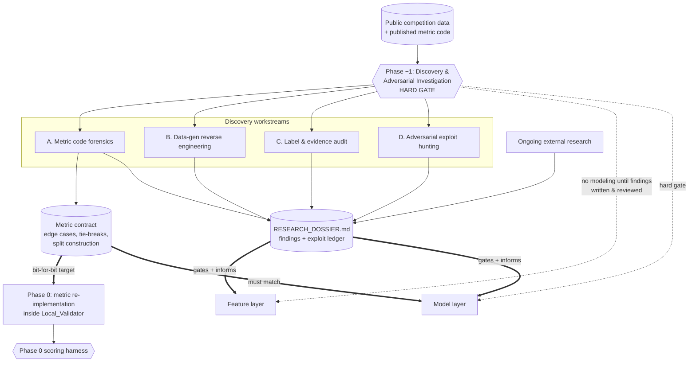
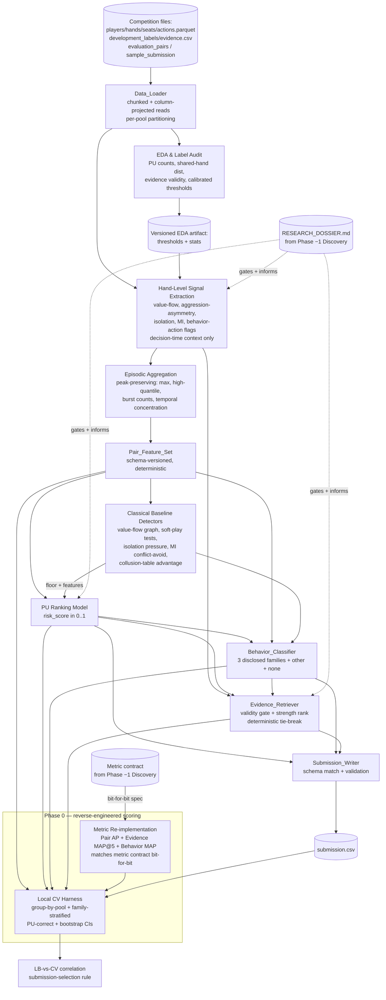

# Design Document: Detect Suspicious Value Transfers in Poker

## Overview

This document designs the attack pipeline for the Kaggle competition **"Detect Suspicious Value Transfers in Poker"**. We ingest ~2,000,000 synthetic six-player No-Limit Hold'em hands across 400 pools, detect coordinated player relationships, and emit a `submission.csv` scored by a three-part metric: **Pair AP**, **Evidence MAP@5**, and **Behavior MAP**.

The design is deliberately organized around three strategic principles that the user learned the hard way on prior competitions (Biohub cell-tracking, AI-Agent-Attack), where variance and public-leaderboard overfitting cost real placement. These principles are first-class architectural constraints, not afterthoughts:

- **Principle 1 — Variance discipline.** The public/private split is ~30/70, stratified by behavior family, and coordination is episodic with wildly uneven per-pair hand counts. The public leaderboard (LB) is therefore noisy. Every decision is gated on a local cross-validation (CV) harness that mimics the *private* split (grouped by pool so no pool leaks across folds, stratified by behavior family, PU-correct), and every metric report carries a variance band (bootstrap CIs over pairs). A change ships only when it clears the noise band. Public-LB-vs-local-CV correlation is tracked as an explicit diagnostic; on divergence we trust local CV.

- **Principle 2 — Reverse-engineer the scoring first.** Phase 0, before any modeling, re-implements the exact three-part metric and verifies it against a hand-constructed example and (when published) reconciles bit-for-bit against the public metric code. The architecture then *exploits* the scoring structure: target-pair coverage and evidence validity dominate Evidence MAP@5; misrouting a true disclosed-family pair is a pure Behavior-MAP loss while over-predicting `other_coordination` is free there; and `risk_score` is a shared lever across Pair AP and the Behavior-MAP per-family score, so its calibration is designed deliberately.

- **Principle 3 — Classical, researched baselines before custom ML.** We ship an explainable classical detector layer end-to-end first (value-flow graph, aggression-asymmetry and soft-play statistical tests, isolation-pressure ratios, mutual-information conflict avoidance, collusion-table advantage) grounded in published prior art, establishing a measurable floor. Learned models (PU-aware ranking, behavior classifier, learned evidence ranker) are layered on only after they beat that floor by more than the noise band. Explainability doubles as winner-verification support (five case reviews with plausible benign alternatives).

These map to the user's 10-commandments steering: scaffold first / no YOLO (phased delivery, Phase 0 harness), security & reproducibility by design (seeded, manifest, no SDK shadowing), quality throughout (bootstrap-gated CV, property-based tests), and documentation excellence (case reviews + reproducibility manifest).

## Discovery and Adversarial Investigation (Phase −1)

This section is the **foundation of the entire pipeline** and precedes every other activity. It exists because of a hard lesson from the prior **AI-Agent-Attack** competition: the winning teams did not simply model harder — they dissected exactly how the scoring code and the (synthetic) data were generated, and used that understanding to find near-unbeatable, rules-legal strategies. Deep discovery of the competition's *actual code and data* is therefore promoted to a first-class, **gating** phase here, not a side note.

**HARD GATE (non-negotiable).** No feature engineering, no modeling (classical or learned), and no submission-tuning work may begin until the Discovery findings for the workstreams below are documented in the living research dossier and reviewed. Phase 0 (the scoring harness) may only start once the **metric contract** (workstream A) is written. If a later phase surfaces a new question about the metric or data, work pauses and returns here to update the dossier before proceeding. This gate is enforced in the Phased Delivery Plan below.

**RULES-COMPLIANCE GUARDRAIL (applies to this entire section).** All investigation uses **only** the provided public competition data and the public metric code that the competition states it will publish. We do **not** attempt to access private labels or private evidence, we do **not** probe or reverse the hidden holdout, and we do **not** violate Kaggle's Terms of Service. Throughout this document, "exploit" means the *legitimate* exploitation of the published scoring structure and the disclosed properties of the synthetic data — understanding the rules of the game and playing them optimally — never cheating, leakage of private artifacts, or ToS circumvention. Any candidate that would require private information is discarded on sight.

### Workstream A — Metric Code Forensics

Obtain and read the **actual public competition metric code line-by-line**. The competition states the metric code will be public; we treat that published code — not the prose description — as ground truth. Re-implementing from the prose is explicitly insufficient because the prose omits edge cases that decide close standings.

We document every implementation detail: each edge case, tie-break, normalization constant, epsilon, rounding rule, and default. Specifically we must characterize and write down:

- **Equal `risk_score` resolution** — how the code orders pairs with identical risk scores (expected: a deterministic `pair_id` tie-break) so our ranking matches its ordering exactly.
- **Unranked / missing pairs** — whether pairs we leave unscored (or omit) receive an implicit score, and what that implicit value is.
- **Evidence MAP@5 with sparse evidence** — exactly how the metric handles fewer than 5 evidence hands and the literal `NO_EVIDENCE` sentinel (padding, ignoring, or penalizing).
- **Missed target pair** — confirmation that a target pair we fail to surface contributes **zero** to Evidence MAP@5 (the coverage-dominance lever).
- **Absent classes in Behavior MAP** — how classes with no predictions score, and confirmation that `other_coordination` is excluded from Behavior MAP.
- **Public/private split construction** — exactly how the ~30/70 public/private split is stratified (by behavior family) and grouped, so our local CV mirrors the *private* split rather than the noisy public one.

**Deliverable — the "metric contract."** A written specification (living in the dossier) enumerating the above so precisely that the Phase-0 re-implementation can match the public code **bit-for-bit**. Property 15 and the Req 10.6 reconciliation test verify this match.

### Workstream B — Data-Generation Reverse Engineering

Because the dataset is fully **synthetic**, it was produced by a generator whose structure leaves fingerprints. Using **only the provided public data**, we systematically probe for that structure and log each finding as a hypothesis to confirm or refute on the development labels:

- **Distribution artifacts** — value ranges, discretization, and distributional shapes that betray generator parameters.
- **ID / timestamp / ordering regularities** — monotonicities, block structure, or spacing in `hand_id`, timestamps, action ordering, or seat assignment.
- **Pool / table construction regularities** — how the 400 pools and their 30-player / ~5,000-hand tables were assembled.
- **Statistical tells separating planted positives from the disclosed confounders** — tilt, weak play, similar strategies, repeated opponent selection, streaks, and strategy changes are all disclosed as *benign* confounders; we characterize what statistically distinguishes a planted positive from each of them.
- **Signature of the hidden `other_coordination` family** — any distributional signature of the undisclosed coordination family, since we cannot template its behavior.

Each finding is framed as a testable hypothesis and confirmed or refuted against the development labels before it informs any feature or model.

### Workstream C — Label & Evidence Structure Audit

Reverse-engineer what makes a **development-evidence hand "planted."** From `development_evidence.csv` we characterize the **behavior-specific action signature per disclosed family** (`directed_transfer`, `soft_play`, `coordinated_isolation`) so that the same signature-detector generalizes to evaluation pairs. We explicitly:

- Confirm the stated invariant that **latent scenario activation alone is never evidence** — a hand qualifies only through a public, behavior-specific action.
- Confirm that each planted evidence hand contains **both players** of the pair **and** a **public behavior-specific action**.
- Derive, per family, the concrete action pattern that the evidence retriever's validity gate must reproduce.

### Workstream D — Adversarial / Exploit Hunting (within competition rules)

We explicitly hunt for the **legitimate scoring-structure exploits a top team would find**. Each candidate is logged in the dossier as a hypothesis and must be **CONFIRMED or REFUTED on local CV** before being adopted:

- **Risk-score calibration alone** — does recalibrating `risk_score` (independent of which pairs we surface) by itself lift Behavior MAP, given the per-family score equals `risk_score` when that family is predicted?
- **Liberal `other_coordination` prediction** — since `other_coordination` is *excluded* from Behavior MAP, predicting it liberally is cost-free in that component; we test that hypothesis while checking its **Pair-AP calibration cost** (it still carries a `risk_score` that affects ranking).
- **Dominant evidence-selection heuristic** — is there a single evidence-selection rule that dominates across pairs?
- **Coverage vs. ranking precision** — under Evidence MAP@5's zero-for-missed-target rule, does maximizing **target-pair coverage** beat maximizing ranking precision?
- **Cross-component trades** — interactions among Pair AP, Evidence MAP@5, and Behavior MAP that let one component be traded for another for net gain.

No exploit ships on intuition; each is adopted only after local-CV confirmation, and only if it is rules-compliant per the guardrail above.

### Workstream E — Living Research Dossier

A maintained research document (`RESEARCH_DOSSIER.md`, alongside this spec) captures findings, open hypotheses, and confirmed/refuted exploits **with their supporting local-CV evidence**. It is the durable memory of Phase −1 and later phases:

- **Every later phase MUST consult it** before making a design choice, and update it when it learns something new.
- **Explicit rule: no modeling begins until Discovery findings are written down and reviewed.** A finding that lives only in someone's head does not count.
- The dossier structure mirrors the workstreams (Metric Contract, Data-Generation Findings, Label/Evidence Signatures, Exploit Ledger) plus an Open-Questions log.
- It **seeds the winner-verification writeup**: the confirmed exploits, the metric contract, and the five case reviews are drawn directly from it, so reproducibility documentation is a byproduct of discovery rather than a separate effort.

## Prior Art and Research

External research is an **ongoing, gating activity that feeds the dossier**, not a one-time literature list captured at kickoff. As new questions arise in any phase (a novel confounder, an unexpected metric edge case, an untemplated `other_coordination` pattern), we return to the literature, and any adopted finding is recorded in the dossier's relevant workstream with its citation before it influences code. The classical baseline layer is grounded in the established collusion-detection literature below. Content from these sources was rephrased for compliance with licensing restrictions.

- **Collusion-table advantage measure** — [Automating Collusion Detection in Sequential Games (AAAI)](https://cdn.aaai.org/ojs/8674/8674-13-12202-1-2-20201228.pdf). Quantifies the advantage accruing to a colluding group *without* assuming any specific behavior pattern. This makes it a natural detector and the natural statistical backbone for the undisclosed `other_coordination` catch-all family, where we cannot template a known behavior.
- **Graph-theoretic pair features** — [Collusion Detection in Team-Based Multiplayer Games (arXiv:2203.05121)](https://arxiv.org/abs/2203.05121). Derives per-pair features from behavioral/social interaction graphs. We adapt this to the per-pool co-seating graph to produce relational pair features (edge strength, isolation topology).
- **Information-theoretic conflict-avoidance detection** — Information-Theoretic Approach to Detect Collusion in Multi-Agent Games ([OpenReview](https://openreview.net/)) and Bonjour et al., [PMLR v180](https://proceedings.mlr.press/v180/). Mutual-information / conflict-avoidance signals are well suited to `soft_play` (colluders avoid taking each other's chips).
- **Graph Neural Networks for complex collusive patterns** — [arXiv:2410.07091](https://arxiv.org/abs/2410.07091). Held as a Phase-3+ escalation once classical and shallow-learned baselines set a floor.
- **Imbalanced Positive-Unlabelled learning** — [arXiv:2209.02459](https://arxiv.org/abs/2209.02459) and [arXiv:2004.09820](https://arxiv.org/abs/2004.09820). Practical AUL/AUC estimation under PU without treating unlabelled examples as negatives; used both for the PU ranking model and for PU-appropriate local Pair-AP estimation.

## Architecture

### Discovery Gating Diagram (Phase −1 → Phase 0)

Discovery is the gate the rest of the pipeline flows through. The metric contract flows into the metric re-implementation inside the Local_Validator, and the dossier feeds the feature and model layers.



### Component and Data-Flow Diagram



### Layered Structure

The pipeline is a directed acyclic flow with four layers:

1. **Ingestion & audit** (`Data_Loader`, EDA) — turns raw files into per-pool analysis tables and a versioned threshold artifact. Everything downstream reads calibrated, documented values rather than magic numbers.
2. **Feature layer** (hand-level signals → episodic aggregation → `Pair_Feature_Set`) — the single source of truth for pair representation, computed identically for development and evaluation periods.
3. **Model layer** (classical baselines → PU ranking → behavior classifier → evidence retriever) — each stage consumes the feature set and the shared `risk_score`.
4. **Output & validation** (`Submission_Writer`, `Local_Validator`) — the validator wraps the whole flow and is the arbiter of whether any change ships.

### Scale Strategy

`actions.parquet` is 18,609,028 rows (~12M player-hand rows). The design never loads it whole:

- **Column projection**: reads only the columns a stage needs (e.g., signal extraction pulls `hand_id, action_no, actor, action, amount, amount_to, to_call, pot_before, stack_before, players_active`).
- **Per-pool processing**: work is partitioned by `pool` / `table_id`. Each pool is 30 players × ~5,000 hands — small enough to hold in memory. The expensive pair-of-co-seated-players computation is *per-pool*: at most C(30,2)=435 candidate pairs per pool rather than a global cross-product, keeping it tractable (400 × 435 ≈ 174k pair-slots, of which only co-seated pairs are materialized).
- **Row-group / chunked reads**: `Data_Loader` accepts a configurable row-group and column selection so the same code runs on a laptop and in a Kaggle kernel.

## Components and Interfaces

### Data_Loader (Req 1)

```python
class DataLoader:
    def __init__(self, input_dir: Path, columns: dict[str, list[str]] | None = None): ...
    def load_players(self) -> pd.DataFrame: ...
    def load_hands(self) -> pd.DataFrame:            # includes phase (dev/eval)
        ...
    def load_seats(self) -> pd.DataFrame: ...
    def iter_actions(self, pool_id: int,
                     columns: list[str] | None = None) -> Iterator[pd.DataFrame]:
        """Chunked, column-projected actions for one pool, ordered by (hand_id, action_no)."""
    def load_labels(self) -> LabelTable: ...          # trusted+, confirmed-, unknown
    def load_evaluation_pairs(self) -> pd.DataFrame: ...
    def load_sample_submission(self) -> pd.DataFrame: ...
    def shared_hands(self, pair: Pair) -> SharedHands: # partitioned dev / eval
        ...
```

Missing keys/columns raise `SchemaError(file, missing_key)` (Req 1.5). Phase is attached from `hands.phase` (Req 1.3).

### EDA & Label Audit (Req 2)

Emits a versioned `eda_artifact.json`: shared-hand-count distribution per pair, PU counts (trusted-positive / confirmed-negative / unknown), disclosed-family label distribution, evidence-validity confirmation (each dev-evidence hand is a shared hand with a behavior-specific action), and evaluation-pair leakage checks. Calibrated thresholds derived here (percentile cut points for signals) are the only tuning constants feature engineering may read.

### Hand-Level Signal Extraction (Req 3)

For each shared hand of a co-seated pair, using **decision-time context only** (`pot_before, stack_before, to_call, players_active, amount, amount_to`):

- `value_flow`: signed net chips transferred between the two players in the hand (contributed via `seats` minus received in outcome).
- `aggression_asymmetry`: per-player ratio of bet/raise actions directed at the partner to all bet/raise actions by that player; lower ⇒ more mutual aggression avoidance.
- `isolation`: ratio of bet/raise actions the pair directs at *others* to those they direct at *each other*.
- `mi_conflict`: mutual-information-style conflict-avoidance signal between the pair's action streams.
- `behavior_action_flag`: boolean per disclosed family — is a behavior-specific action present (for evidence eligibility).

`all_in` is classified as a call when `amount <= to_call`, else aggressive (Req 3.4). Zero-denominator ratios get a defined `NOT_APPLICABLE` sentinel, never an error (Req 3.5).

### Episodic Aggregation (Req 4)

Aggregates hand-level signals into pair features preserving episodic peaks: `max`, high quantiles (p90/p95), burst counts (runs of consecutive high-signal shared hands), plus means. Adds a **temporal-concentration** feature (e.g., Gini / dispersion of high-signal hand timestamps) and **count-robust** normalizations (empirical-Bayes shrinkage toward the pool prior) so few-hand and many-hand pairs are comparable.

### Classical Baseline Detectors (Req 5, Principle 3)

Explainable, no-training detectors producing both a score and a human-readable reason string (feeds case reviews):

- Chip-transfer / value-flow graph score.
- Aggression-asymmetry & soft-play statistical tests.
- Isolation-pressure ratio.
- Mutual-information conflict avoidance.
- Collusion-table advantage (AAAI) — behavior-agnostic, backbone for `other_coordination`.

These combine into a baseline `risk_score` that drives a full end-to-end submission in Phase 1.

### PU Ranking Model (Req 6)

Trains on trusted positives (positive) + unknown pairs (unlabelled, *not* negative) + confirmed negatives (reliable negative), outputting `risk_score ∈ [0,1]` for every evaluation pair. Uses PU-appropriate estimators (arXiv:2209.02459, arXiv:2004.09820). Unscoreable pairs get a defined default (Req 6.4). Parameters and seeds persisted for exact reproduction (Req 6.7).

### Behavior_Classifier (Req 7)

Predicts one of `{none, directed_transfer, soft_play, coordinated_isolation, other_coordination}`. Trains disclosed-family heads on trusted-positive labels; routes coordinated-but-untemplated pairs to `other_coordination`; assigns `none` below a coordination threshold. Per-family score = `risk_score` when that family is predicted else 0 (Req 7.4, shared lever).

### Evidence_Retriever (Req 8)

Selects 0–5 evaluation-period shared hands per pair, each passing the hard validity gate (both players present, evaluation period, behavior-specific action present), ranked by evidence-strength descending with ascending-hand-id tie-break; fills remaining slots with `NO_EVIDENCE`; no repeats; every cell non-empty.

### Submission_Writer (Req 9) & Local_Validator (Req 10)

Writer emits the exact `sample_submission.csv` schema to `/kaggle/working/submission.csv` (or configurable local path) and self-validates headers/rows/pair-id set. Validator reproduces all three metric components with PU-correct splits and bootstrap CIs, reconciling against public metric code when available.

## Data Models

```python
@dataclass(frozen=True)
class Pair:
    pair_id: str
    player_a: int          # canonical: min(id)
    player_b: int          # canonical: max(id)
    pool_id: int

@dataclass
class HandSignal:
    hand_id: int
    pair_id: str
    phase: str             # "development" | "evaluation"
    value_flow: float
    aggression_asymmetry: float | Sentinel   # NOT_APPLICABLE allowed
    isolation: float | Sentinel
    mi_conflict: float
    behavior_action_flags: dict[str, bool]   # per disclosed family

@dataclass
class PairFeatureSet:
    pair_id: str
    schema_version: str
    features: dict[str, float]     # peak-preserving + concentration + count-robust + confounder
    threshold_version: str

@dataclass
class LabelTable:
    trusted_positive: dict[str, str]   # pair_id -> target_behavior
    confirmed_negative: set[str]
    # everything else in development = unknown (PU)

@dataclass
class PairPrediction:
    pair_id: str
    risk_score: float                  # [0,1]
    predicted_behavior: str
    evidence: list[str]                # length 5, hand ids or "NO_EVIDENCE"
    reasons: list[str]                 # explainability for case review
```

Submission row schema (exact `sample_submission.csv` order): `pair_id, risk_score, predicted_behavior, evidence_hand_1..5`.

## Correctness Properties

*A property is a characteristic or behavior that should hold true across all valid executions of a system — essentially, a formal statement about what the system should do. Properties serve as the bridge between human-readable specifications and machine-verifiable correctness guarantees.*

These properties are derived from the acceptance-criteria prework and consolidated to remove redundancy. Each is implemented by a single property-based test running ≥100 iterations.

### Property 1: Directed value-flow is antisymmetric

*For any* shared hand and any ordered pair of its co-seated players (a, b), the directed value-flow signal satisfies `value_flow(a, b) == -value_flow(b, a)`.

**Validates: Requirements 3.1**

### Property 2: All-in classification follows the amount/to_call rule

*For any* action with `action == all_in`, the classification is a call when `amount <= to_call` and an aggressive action otherwise.

**Validates: Requirements 3.4**

### Property 3: Zero-denominator signals yield the sentinel, never an error

*For any* shared hand in which the relevant bet/raise denominator for the aggression-asymmetry or isolation signal is zero, the computed signal equals the defined `NOT_APPLICABLE` sentinel and no error is raised.

**Validates: Requirements 3.5**

### Property 4: Episodic concentration never lowers the coordination signal

*For any* two synthetic pair timelines with equal mean hand-level signal, the timeline containing a concentrated episode produces a coordination feature that is greater than or equal to the uniformly distributed timeline's.

**Validates: Requirements 4.1, 4.2**

### Property 5: Feature computation is deterministic

*For any* input tables, computing the `Pair_Feature_Set` twice from the identical input produces identical feature values for every pair.

**Validates: Requirements 5.3, 5.5**

### Property 6: Risk score coverage and range

*For any* set of evaluation pairs and feature sets, the Risk_Model outputs exactly one `risk_score` per evaluation pair, every score is a real number in the inclusive interval [0.0, 1.0], and no pair is omitted.

**Validates: Requirements 6.3, 6.4**

### Property 7: Ranking and evidence ordering are independent of input row order

*For any* input, permuting the row order of the input tables leaves the produced pair ranking and per-pair evidence ordering unchanged, because ties break deterministically on `pair_id` (ranking) and ascending hand id (evidence).

**Validates: Requirements 6.5, 8.5**

### Property 8: Below-threshold pairs are routed to `none`

*For any* pair whose `risk_score` is below the configured coordination threshold, the Behavior_Classifier assigns `none`.

**Validates: Requirements 7.6**

### Property 9: Every selected evidence hand is valid

*For any* evaluation pair, every non-`NO_EVIDENCE` cell references a hand that contains both players of the pair, occurs within the Evaluation_Period, and contains at least one behavior-specific action; and at most 5 hands are selected.

**Validates: Requirements 8.1, 8.2, 8.3, 8.4**

### Property 10: Evidence slots are complete and non-empty

*For any* evaluation pair, exactly 5 evidence positions are emitted, each non-empty, and every position beyond the count of available valid hands equals the literal `NO_EVIDENCE`.

**Validates: Requirements 8.6, 8.7**

### Property 11: No repeated evidence hand within a pair

*For any* evaluation pair, no hand id appears in more than one of its 5 evidence positions.

**Validates: Requirements 8.8**

### Property 12: Evidence positions are sorted by strength then hand id

*For any* set of valid evidence hands for a pair, the assigned positions are in descending order of evidence-strength score, with ties broken by ascending hand id.

**Validates: Requirements 8.5**

### Property 13: Submission matches the sample schema (round-trip)

*For any* set of evaluation pairs and a sample submission, the written submission has identical column headers in identical order, an identical row count, and the exact same set of `pair_id` values as `sample_submission.csv`.

**Validates: Requirements 9.1, 9.2, 9.6**

### Property 14: Submission field domains

*For any* written submission, every row's `risk_score` lies in [0, 1] and every `predicted_behavior` is one of `{none, directed_transfer, soft_play, coordinated_isolation, other_coordination}`.

**Validates: Requirements 9.3, 9.4**

### Property 15: Local metric matches a reference implementation (PU-correct)

*For any* set of rankings, labels, evidence lists, and family assignments, the Local_Validator's three components equal an independent reference implementation, where a missed target pair contributes zero to Evidence MAP@5 and `other_coordination` is excluded from Behavior MAP.

**Validates: Requirements 10.1, 10.2, 10.3, 10.4**

### Property 16: Selected configuration reproduces the submission

*For any* fixed configuration and seed, running the pipeline twice on identical input produces byte-identical `submission.csv` (equal output checksum).

**Validates: Requirements 11.2**

## Error Handling

| Condition | Handling | Requirement |
|---|---|---|
| Missing input file, `hand_id`, `player_id`, or expected column | Raise `SchemaError(file, missing_key)` with a descriptive message identifying file and key; no downstream work proceeds | 1.5 |
| `actions.parquet` too large for memory | Chunked / column-projected / per-pool reads via configurable row-group and column selection; never load whole | 1.6 |
| Zero-denominator hand-level signal | Assign `NOT_APPLICABLE` sentinel, continue; never raise or produce undefined | 3.5 |
| Risk_Model cannot score a pair | Assign a defined default `risk_score` (pool prior); pair is never dropped | 6.4 |
| Required training/scoring input missing or empty | Halt with descriptive error; do **not** write a partial output file (atomic write: temp file + rename on success) | 6.8 |
| Fewer than 5 valid evidence hands | Fill remaining positions with `NO_EVIDENCE`; never emit an empty cell | 8.6, 8.7 |
| Duplicate candidate evidence hand | De-duplicate before slot assignment | 8.8 |
| Submission fails schema/row/pair-id validation | Raise a descriptive error before the file is considered complete; do not submit | 9.6, 9.7 |
| Local `aicomp_sdk.py` / helper shadows real SDK | Detect and remove local stub before execution in the Kaggle kernel | 11.6 |
| Local CV diverges from public LB | Diagnostic logged; submission-selection rule defaults to local CV (see Design Decisions) | Principle 1 |

Errors are typed and logged with the offending identifiers. Writes are atomic (write-temp-then-rename) so a crash never leaves a half-written `submission.csv`.

## Testing Strategy

We use a **dual approach**: property-based tests for universal invariants and example/integration tests for specific behavior and fixtures. PBT applies here because the core logic (feature computation, evidence selection, metric, submission formatting) consists of pure functions with clear input/output behavior and large input spaces.

### Property-Based Tests

- Library: **Hypothesis** (already present in this workspace, `.hypothesis/` cache), matching the user's Python/PyTorch stack.
- Each of Properties 1–16 is implemented by exactly one property-based test, ≥100 iterations.
- Each test carries a tag comment of the form:
  `# Feature: poker-collusion-detection, Property {n}: {property_text}`
- Generators produce synthetic pools, hands, action logs (including degenerate hands: no bet/raise opportunities, all-in edge amounts, single-hand pairs), labels (PU structure with unknowns), and sample submissions. We do not hand-roll a PBT framework.
- The metric property (15) is a **model-based** test comparing our implementation to an independent, deliberately simple reference; Evidence MAP@5 generators include missed-target-pair cases (must contribute zero) and Behavior-MAP generators include `other_coordination` (must be excluded).

### Example and Integration Tests

- **Fixtures** (tiny constructed tables) for data loading/joining and shared-hand partitioning (Req 1.1–1.4), EDA/audit reporting (Req 2), and joint three-component reporting (Req 12.2, 12.4).
- **Edge-case tests** for descriptive errors on missing files/columns and no-partial-output guarantees (Req 1.5, 6.8).
- **Smoke test** that no local stub shadows the real SDK before execution (Req 11.6).
- **Reconciliation test — bit-for-bit against the actual public metric code** (Req 10.6, Property 15, Phase −1 workstream A): run our re-implementation and the **actual published competition metric code** on a battery of identical inputs (including the edge cases enumerated in the metric contract: equal `risk_score` tie-breaks, unranked/missing pairs, fewer-than-5 and `NO_EVIDENCE` evidence, missed target pairs, absent Behavior-MAP classes) and assert exact equality on all three components. Any divergence is a release blocker, not a warning.
- **Metric-contract acceptance check** (Phase −1 gate): assert that the metric-contract document exists in the dossier and that the re-implementation matches it — every documented edge case, tie-break, constant, epsilon, rounding rule, default, and the split-construction rule has a corresponding assertion in the reconciliation battery. The re-implementation may not diverge from the contract without a matching contract update.
- **End-to-end** run on a small synthetic pool producing a schema-valid submission and a reproducibility manifest.

### Validation Discipline (Principle 1)

Every metric report from the Local_Validator includes bootstrap confidence intervals over pairs for all three components. A change is accepted only when its point estimate improvement exceeds the noise band. The LB-vs-CV correlation is recorded per submission as a standing diagnostic.

## Design Decisions and Rationale

- **Deep code & data discovery is a hard gate (Phase −1).** On the prior **AI-Agent-Attack** competition, the strongest scores came from teams that dissected exactly how the scoring code and the synthetic data were generated and then played those rules optimally — not from teams that merely modeled harder. We encode that lesson as a non-negotiable gate: the metric contract, data-generation findings, evidence signatures, and the exploit ledger must be written down and reviewed in the dossier before any feature engineering or modeling begins. The cost of a few days of forensics is trivial against the cost of optimizing a proxy that diverges from the real objective or missing a rules-legal exploit a competitor finds. **Rules-compliance stance:** discovery and exploitation use only public data and the published metric code; "exploit" means legitimate use of the published scoring structure and disclosed synthetic-data properties, never private-artifact access or ToS circumvention.
- **Phase 0 scoring first (Principle 2).** Re-implementing the metric before modeling removes the single biggest source of wasted effort: optimizing a proxy that diverges from the real objective. Guided by the Phase −1 metric contract, the re-implementation targets a bit-for-bit match with the public code, and it exposes exploitable structure (coverage/validity dominance in Evidence MAP@5; free over-prediction of `other_coordination` in Behavior MAP; `risk_score` as a shared calibration lever).
- **Group-by-pool CV (Principle 1).** Because pools are persistent 30-player tables, splitting by pool prevents player/pool leakage and mimics the private split's structure. Family stratification keeps rare disclosed families represented in every fold.
- **Bootstrap-gated acceptance (Principle 1).** Point-estimate chasing on a ~30% public LB is how prior competitions were lost. Confidence bands turn "looks better" into "is better beyond noise."
- **Classical baseline first (Principle 3).** An explainable end-to-end submission sets a floor, de-risks the submission mechanics early, and produces the reason strings needed for the five winner-verification case reviews. Learned models must beat the floor by more than the noise band to ship.
- **PU-correct throughout (Req 6, 10).** Treating unknown pairs as negatives would bias both training and local Pair-AP. PU-aware estimators (arXiv:2209.02459, arXiv:2004.09820) are used for the model and the local metric.
- **Shared `risk_score` (Req 12.3).** Since the Behavior-MAP per-family score equals `risk_score` when predicted, calibrating one score serves both Pair AP and Behavior MAP; we tune it deliberately rather than letting two heads drift.
- **Deterministic tie-breaks and atomic writes (Req 5.5, 6.5, 8.5, 9, 11.2).** Reproducibility is a competition requirement (winner verification) and a correctness property; determinism is engineered in, not hoped for.
- **Submission-selection rule.** Among candidate configs, select the one maximizing the combined three-component summary on local CV; break near-ties toward the configuration with the *narrower* CV band (lower variance), and never select on public LB alone. On LB-vs-CV divergence, trust CV.

## Phased Delivery Plan

Discovery is the first phase and a hard gate for everything after it. Beyond clearing the local-CV noise band relative to the prior phase, **every phase must additionally be consistent with the documented metric contract and must consult (and update) the research dossier** before shipping.

- **Phase −1 — Discovery & Adversarial Investigation (HARD GATE).** Execute workstreams A–E: metric code forensics (producing the bit-for-bit **metric contract**), data-generation reverse engineering, label & evidence structure audit, adversarial exploit hunting, and the living `RESEARCH_DOSSIER.md`. *Gate: the metric contract is written; Discovery findings and the initial exploit ledger are documented and reviewed. No feature engineering, modeling, or submission tuning may begin until this gate is cleared.*
- **Phase 0 — Scoring harness + local CV.** Re-implement and verify the three-part metric **against the metric contract and the actual public metric code** (hand-constructed example; reconcile bit-for-bit). Build the group-by-pool, family-stratified, PU-correct CV harness with bootstrap CIs and the LB-vs-CV diagnostic. *Gate: metric matches the metric contract / public code bit-for-bit; harness produces stable CIs. Consistent with dossier.*
- **Phase 1 — Classical baseline end-to-end.** Data loader, EDA/audit, hand-level signals, episodic aggregation, classical detectors, evidence retriever, submission writer — the signature detectors reproduce the evidence signatures characterized in Discovery workstream C. Produces a valid, reproducible submission. *Gate: submission accepted; establishes the measurable floor; consistent with metric contract and dossier.*
- **Phase 2 — PU ranking + behavior classifier.** Layer the PU-aware ranking model and behavior classifier on the feature set; calibrate the shared `risk_score`, adopting only the exploits confirmed on local CV in Discovery workstream D. *Gate: beats Phase-1 floor beyond the noise band on combined summary; consistent with metric contract and dossier.*
- **Phase 3 — Learned evidence ranker + joint tuning.** Learned evidence-strength scorer and joint tuning across the three components; optional GNN escalation (arXiv:2410.07091). *Gate: beats Phase-2 beyond the noise band with no component regression; consistent with metric contract and dossier.*

If any phase surfaces a new metric or data question, work returns to Phase −1 to update the dossier and (if needed) the metric contract before continuing.

## Requirements Traceability

| Component / Section | Requirements satisfied |
|---|---|
| Discovery & Adversarial Investigation (Phase −1) | 10.6 (metric contract → bit-for-bit reconciliation); 2.x (EDA / label audit, workstream C); 8.x (evidence signature per family, workstream C); 11.x (reproducibility & winner-verification via dossier, workstreams A/E) |
| Data_Loader | 1.1–1.6 |
| EDA & Label Audit | 2.1–2.6 |
| Hand-Level Signal Extraction | 3.1–3.8 |
| Episodic Aggregation | 4.1–4.4 |
| Pair Feature Engineering / `Pair_Feature_Set` | 5.1–5.5 |
| Classical Baseline Detectors | 3.x, 5.1, 5.2; Principle 3 |
| PU Ranking Model | 6.1–6.8 |
| Behavior_Classifier | 7.1–7.6 |
| Evidence_Retriever | 8.1–8.8 |
| Submission_Writer | 9.1–9.7 |
| Local_Validator | 10.1–10.6 |
| Error Handling section | 1.5, 3.5, 6.4, 6.8, 8.6–8.8, 9.6, 9.7, 11.6 |
| Correctness Properties + Testing Strategy | 3.1, 3.4, 3.5, 4.1, 4.2, 5.3, 5.5, 6.3–6.5, 7.6, 8.1–8.8, 9.1–9.4, 9.6, 10.1–10.4, 11.2 |
| Reproducibility (manifest, seeds, case reviews, SDK) | 11.1–11.6 |
| Joint optimization + submission-selection rule | 12.1–12.4 |
| Phased Delivery Plan | Principles 1–3; scaffold-first (commandment 4) |
