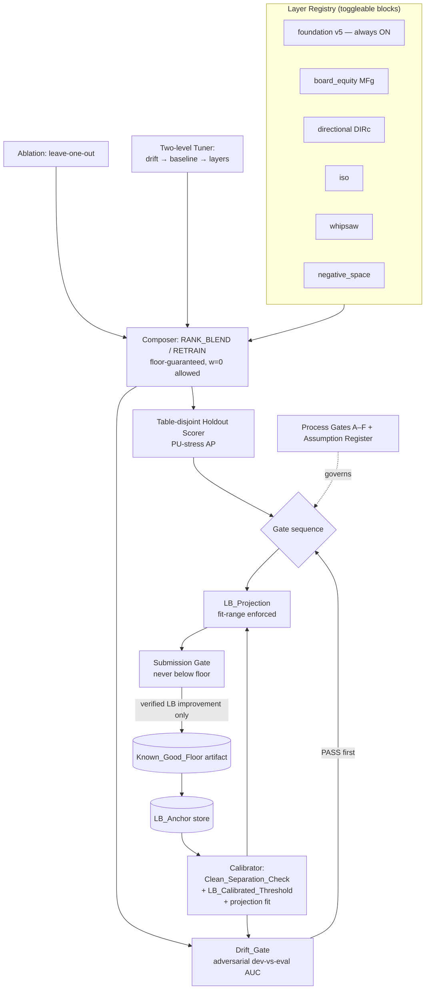

# Design Document

## Overview

This design specifies the **layered detection + LB-calibrated tuning harness** for the "Detect Suspicious Value Transfers in Poker" competition. It is a follow-on to `poker-collusion-detection`: that spec built the detection pipeline; this one builds the *validation, composition, and tuning methodology* that lets us change the model without regressing on the leaderboard.

The design is deliberately grounded in the durable memory recorded in `poker-collusion-detection/RESEARCH_DOSSIER.md`, not in assumptions. The load-bearing ground truths it must not contradict:

- **Known-good floor.** `cand_exp4c_directional` scored a **real leaderboard 0.44519** (dossier §33) and is promoted to `submission_best_044519.csv`. Its feature stack is **v5 event-detector features (foundation) + graded board-equity (MFg, §32) + drift-hardened directional/fold-timing/excess-win (DIRc, §33)**. The prior plateau was `cand_18 = 0.39372` (simple cached-feature ensemble, §15). Recent structural additions — interactions (§34) and triadic/ring (§35) — were **NULL** (redundant with the foundation; the GBDT already learns those combinations internally).
- **Adversarial validation is the single most valuable gate** (§29, §32, §33). Training a classifier to distinguish dev rows from eval rows on a feature set, the **adversarial AUC must be < ~0.65** or the features *drift* dev→eval and are disqualified regardless of any CV/holdout number. This is exactly what separated the winning features (AUC **0.639 / 0.644**, PASS) from the rich stacks that regressed 0.39→0.30 (AUC **0.865**, FAIL). **The Drift_Gate in Requirement 1 IS this adversarial-validation gate.**
- **The holdout is a table-disjoint, pair-disjoint split**: train on 60% of dev *tables*, judge on the unseen 40% of tables (the eval-mimic table holdout). The internal ranking metric measured on it is **PU-stress AP**.
- **The calibrated LB predictor is real** (§17): `LB ≈ 1.4235 · PU_stress_AP − 0.1414` (residual std ~0.0022), but it is **valid only within the sampled regime** — extrapolation is banned (contract Rule 4). The `LB_Projection` must record and enforce its fit range.
- **Self-referential validation is the core failure mode** (§29): every validator computed inside the same dev pipeline shares the same blind spot. Only **external judges** — adversarial validation, a holdout that shares *no tables*, and the leaderboard — are trustworthy. The gate sequence must therefore be **adversarial-drift PASS first, THEN holdout is a trustworthy LB predictor** (Requirement 1 / §17).

The deliverable is a reproducible harness that, given the current layers, reports each layer's contribution, projects a leaderboard score with honest uncertainty, and emits a single submission-ready candidate that is the leanest configuration clearing the LB-calibrated gate — with process gates (A–F) hard-wired so the work cannot sprawl onto an unverified base.

### Design principles (derived directly from the accountability contract)

1. **External judge only.** A result is "real" only when confirmed by adversarial validation, the table holdout that shares no tables, or the leaderboard (contract Rule 1). All internal metrics are hypotheses.
2. **Floor-guaranteed composition.** No layer is ever concat-retrained or fixed-weight-blended onto the known-good baseline (contract Rule 15). Composition is a weighted blend with `w=0` allowed and tuned on holdout, so the floor is a hard floor.
3. **No extrapolation.** Every estimator/calibration carries the range it was fit on; applying it outside is banned (Rule 4).
4. **Drift gate is a gatekeeper, not a vote** (Rule 17): drift PASS *first*, then holdout is a trustworthy LB predictor — a sequence, not parallel votes.
5. **Sample-size shrinkage for all per-pair statistics** (Rule 16): eval pairs are low-co-hand (median ~76), so raw per-pair rates are noise.
6. **Reuse, do not rebuild.** The existing `poker/poker_collusion` package (metric reference, group-by-pool CV harness, PU ranker, feature caches, submission writer) is the substrate; this harness wraps it.

### Reused existing components (from `poker/poker_collusion`)

| Existing module | Role in this harness |
| --- | --- |
| `metric/reference_public_metric.py` | Bit-for-bit public scorer (0.70 PairAP / 0.20 EvidenceMAP@5 / 0.10 BehaviorMAP). Source of truth for scoring. |
| `validation/cv.py`, `phase1_baseline_cv.py` | Group-by-pool (`table_id`) CV harness; the table-disjoint split machinery. |
| `validation/phase2_gate.py` | Existing gate scaffolding (`run_phase2_gate`, `Phase2GateResult`) to extend for the drift/holdout sequence. |
| `validation/bootstrap.py`, `exploit_eval.py` | Bootstrap CIs and exploit-level holdout evaluation. |
| `features/feature_cache.py`, `pair_features.py`, `signals.py` | v5 / board-equity / directional feature caches — wrapped as **layers**, not recomputed. |
| `models/pu_ranker.py`, `learned_risk.py` | Baseline risk models tuned by `Baseline_Tuning`. |
| `submission/writer.py` | Emits the submission-ready CSV; the floor artifact is written through here. |

## Architecture

The harness is a thin orchestration layer over the existing package. Data flows one way: layers → composition → holdout scoring → gate sequence → projection → submission gate. Nothing writes the floor artifact except a leaderboard-verified improvement.



### The gate sequence (Requirement 1 + §17 + Rule 17)

Gates run **in sequence, not in parallel**, because the holdout is only a trustworthy LB predictor *after* drift passes:

1. **Drift_Gate (external).** Adversarial dev-vs-eval AUC on the candidate's feature set. If it FAILs the LB-calibrated threshold, the candidate is disqualified and the holdout number is **not** trusted (a drift-failing feature's holdout is inverted — it rewards dev-only signal, Rule 17). A drift fail on a *novel* layer is a debugging task (encoding/shrinkage/composition), not a verdict on the idea (contract Rule 11).
2. **Holdout scoring (internal, now trustworthy).** PU-stress AP on the table-disjoint 40% split.
3. **LB_Projection.** Only for drift-passing configs, only within the calibrator's fit range.
4. **Submission gate.** Never recommends a candidate projected below the floor.

### Two-level tuning order (Requirement 5)

Tuning is strictly sequenced to avoid overfitting the holdout: **resolve feature-set drift → tune Baseline model → tune Layers**, all on coarse structural grids. Two independent guarantees are enforced (Req 5.3): (a) a selected config must clear the Drift_Gate, and (b) a tuned gain that increases drift past the threshold is rejected — and (b) holds independently of (a).

## Components and Interfaces

All components are pure where possible (deterministic given inputs), so they are directly property-testable. Side effects (reading caches, writing the floor artifact) are isolated to the I/O adapters.

### Layer registry — `layers/registry.py`

```python
@dataclass(frozen=True)
class Layer:
    name: str                       # "foundation" | "board_equity" | "directional" | "iso" | "whipsaw" | "negative_space"
    kind: str                       # "monotone" -> RANK_BLEND default; "conditional" -> RETRAIN default
    feature_keys: tuple[str, ...]   # keys into the existing feature caches (reuse, not recompute)
    optional: bool                  # foundation is not optional

FOUNDATION = Layer("foundation", "conditional", V5_KEYS, optional=False)  # the floor's base

def known_good_floor_config() -> "CandidateConfig":
    """The exact LB-verified stack: foundation + board_equity + directional, all default knobs."""
```

### Composer — `composition/composer.py`

Composes optional layers onto the base with a **hard floor guarantee**. Two modes (Requirement 4):

```python
def rank_blend(base_ranking: RankVector, layer_ranking: RankVector, weight: float) -> RankVector:
    """weight in [0,1]. weight == 0.0 MUST return base_ranking exactly (Req 2.2)."""

def retrain(base_features: FeatureFrame, layer_features: FeatureFrame,
            model_cfg: ModelConfig) -> RankVector:
    """Refit the baseline model on base+layer features. Result is trusted ONLY after the combined
    feature set clears the Drift_Gate (Req 4.2)."""

def compose(cfg: CandidateConfig) -> Candidate:
    """All optional layers OFF -> reproduce Known_Good_Floor exactly (Req 2.1). Reports layers-ON
    best-effort; a reporting failure never blocks assembly (Req 2.3, 2.4)."""
```

`rank_blend` uses a convex combination of *ranks* (not raw scores): `blended = (1-w)·rank(base) + w·rank(layer)`; at `w=0` it is `rank(base)` re-ranked, which is order-identical to `base`. This is what makes `w=0 == base` exact and makes a correct layer unable to regress the floor (contract Rule 15).

**Corrupting-layer detection (Req 2.5):** if a layer reduces holdout AP at *every* positive weight in the tuning grid, it is flagged `CORRUPTING` (it displaces known-good signal) rather than merely `NULL`.

### Drift_Gate (adversarial validation) — `gate/drift_gate.py`

```python
@dataclass(frozen=True)
class DriftResult:
    adversarial_auc: float          # dev-vs-eval classifier AUC on the feature set
    verdict: str                    # "PASS" | "FAIL"
    threshold: float
    threshold_kind: str             # "LB_CALIBRATED" | "PROVISIONAL"

def adversarial_auc(feature_frame: FeatureFrame) -> float:
    """Train a classifier (logistic / GBDT) with target = is_eval_row; return dev-vs-eval AUC via
    grouped CV. High AUC => features describe 'which pool' not 'is collusion'."""

def evaluate_drift(feature_frame: FeatureFrame, calib: Calibration) -> DriftResult:
    """Classify using calib.threshold when TRUSTED; else PROVISIONAL (Req 1.1, 1.6, 1.7)."""
```

### Calibrator — `gate/calibration.py`

Turns the `LB_Anchor` store into a trusted or provisional threshold and the projection fit.

```python
@dataclass(frozen=True)
class LBAnchor:
    config_id: str
    real_lb: float
    measured_drift: float           # adversarial AUC
    holdout_ap: float               # PU-stress AP

@dataclass(frozen=True)
class SeparationCheck:
    max_pass_drift: float           # max drift among anchors at/above floor
    min_fail_drift: float           # min drift among regressed anchors
    separable: bool                 # max_pass_drift < min_fail_drift (strict)

@dataclass(frozen=True)
class Calibration:
    threshold: float
    threshold_kind: str             # "LB_CALIBRATED" | "PROVISIONAL"
    trusted: bool
    separation: SeparationCheck
    null_surfaced: bool             # True when drift does NOT separate LB outcomes
    projection: "ProjectionFit | None"

def clean_separation_check(anchors: list[LBAnchor], floor_lb: float) -> SeparationCheck:
    """PASS anchors = real_lb >= floor_lb; FAIL anchors = regressed. Separable IFF
    max_pass_drift < min_fail_drift strictly (Req 1.4)."""

def calibrate(anchors: list[LBAnchor], floor_lb: float) -> Calibration:
    """Req 1.5/1.6/1.7: if not separable -> gate INVALID, no trusted threshold, surface the null.
    If separable AND >=3 anchors -> LB_CALIBRATED threshold in the open gap. Else PROVISIONAL."""
```

**Threshold placement.** When separable and ≥3 anchors, the `LB_Calibrated_Threshold` is placed in the open interval `(max_pass_drift, min_fail_drift)` (midpoint by default) so every PASS anchor classifies PASS and every FAIL anchor classifies FAIL by construction (Req 1.2, 1.3, 1.8). The `PROVISIONAL` threshold falls back to the historical single-feature value (~0.65) with reduced-confidence labelling (Req 1.7).

**Grounding note.** The current anchor set (dossier) is: PASS anchors at drift 0.639 (DIRc) and 0.644 (MFg) — both at/above-floor-contributing — vs the FAIL anchor at 0.865 (leaky exp4b, which would have regressed). The foundation's whole-stack drift is ~0.679 (requirements) — the design must let this whole-stack PASS via the calibrated gap between 0.644 and 0.865, which the fixed 0.65 wrongly rejected. This is the exact motivating bug.

### Holdout scorer — `holdout/scorer.py`

Wraps the existing group-by-`table_id` CV to produce PU-stress AP on the 40% table-disjoint split. Reuses `validation/cv.py` and `reference_public_metric.py`.

### Ablation — `ablation/leave_one_out.py`

```python
def ablate(cfg: CandidateConfig) -> dict[str, float]:
    """For each ON layer: full_holdout - holdout_without_layer (Req 3.1). <=0 -> recommend removal
    (Req 3.2). Returns leanest subset within tolerance of best (Req 3.3)."""
```

### Two-level tuner — `tuning/tuner.py`

```python
def tune(cfg: CandidateConfig, calib: Calibration) -> TunedConfig:
    """Order: resolve drift -> Baseline_Tuning -> Layer_Tuning (Req 5.1), coarse grids only
    (Req 5.2). Enforces: selected config clears Drift_Gate (5.3a) AND any tuned gain that pushes
    drift past threshold is rejected (5.3b), independently. Reports LB_Projection (5.4)."""
```

### Sample-size shrinkage — `shrinkage/eb.py`

```python
def shrink(value: float, n: int, k: float, prior: float) -> float:
    """Empirical-Bayes: prior + (value - prior) * n / (n + k). n = shared_hand count.
    Monotone in n; at n=0 returns prior; as n->inf returns value (Req 6.1)."""

def sweep_shrinkage(layer, k_grid: list[float]) -> ShrinkageChoice:
    """FULL sweep — never stops early (Req 6.2). Verify: top-K-by-score median shared-hand count
    is NOT below the population median."""
```

### Projection + submission gate — `projection/project.py`, `submission/gate.py`

```python
@dataclass(frozen=True)
class ProjectionFit:
    slope: float                    # ~1.4235
    intercept: float                # ~-0.1414
    resid_std: float                # ~0.0022
    fit_min_ap: float               # regime lower bound
    fit_max_ap: float               # regime upper bound
    n_points: int

def project_lb(holdout_ap: float, fit: ProjectionFit) -> Projection:
    """Returns (point, uncertainty, regime_verified). regime_verified is False if holdout_ap is
    outside [fit_min_ap, fit_max_ap] -> NO extrapolation (Rule 4). Off-regime projections are
    reported but flagged unverified."""

def submission_report(candidate) -> SubmissionReport:
    """Emits layers ON, holdout AP, measured drift, gate verdict, LB_Projection, regime-verified
    flag (Req 7.1). Does NOT recommend submission if Drift_Gate FAILs (Req 7.2, Gate C)."""

def record_anchor_and_recalibrate(real_lb: float, candidate) -> Calibration:
    """After a real LB returns, append a new LB_Anchor and recalibrate gate + projection (Req 7.3)."""
```

The floor artifact (`submission_best_044519.csv`) is **only** overwritten through a guarded writer that requires a leaderboard-verified improvement (Req 7.4).

## Data Models

```python
@dataclass(frozen=True)
class CandidateConfig:
    layers_on: frozenset[str]                 # optional layers switched ON
    composition: dict[str, CompositionSpec]   # per-layer mode + weight
    model_cfg: ModelConfig                    # baseline hyperparameters + PU weights
    shrinkage: dict[str, float]               # per-layer k

@dataclass(frozen=True)
class CompositionSpec:
    mode: str                                 # "RANK_BLEND" | "RETRAIN"
    weight: float                             # RANK_BLEND weight in [0,1]; 0 allowed

@dataclass(frozen=True)
class Candidate:
    config: CandidateConfig
    ranking: RankVector                       # per-pair risk ranking
    layers_reported: tuple[str, ...] | None   # best-effort; None on reporting failure

@dataclass(frozen=True)
class SubmissionReport:
    layers_on: tuple[str, ...]
    holdout_ap: float
    measured_drift: float
    gate_verdict: str
    projection: Projection
    regime_verified: bool
    recommend_submit: bool
```

`RankVector` is a per-`pair_id` ordering; `FeatureFrame`/`FeatureFrame` are thin views over the existing feature caches keyed by `pair_id`. The `LB_Anchor` store is a small append-only JSON/CSV alongside `RESEARCH_DOSSIER.md`, so recalibration is reproducible and externally auditable (Gate F, Req 8.7).

### Assumption register (Gate B, Requirement 8.2)

Design MUST NOT proceed past an unfalsified load-bearing assumption. Each carries its cheapest falsifying test and the action if false.

| # | Load-bearing assumption | Cheapest falsifying test | Action if false |
| --- | --- | --- | --- |
| A1 | **Drift cleanly separates PASS from FAIL LB anchors** (a single threshold discriminates). | `clean_separation_check` on the current anchors: is `max_pass_drift < min_fail_drift` strictly? | Gate INVALID; surface the null (Req 1.5); fall back to PROVISIONAL; do not report a trusted threshold. |
| A2 | The adversarial dev-vs-eval AUC is the drift signal that predicts LB transfer. | Re-check that the 0.865 anchor regressed and 0.639/0.644 held (already in dossier §33). | Replace the drift statistic; re-derive anchors. |
| A3 | The LB↔PU-stress-AP line (slope 1.4235) holds within the sampled AP range. | Compare a new drift-passing submission's real LB to the projected value; residual ≤ ~2·resid_std. | Mark regime unverified; refit; never extrapolate. |
| A4 | Turning all optional layers OFF reproduces the floor's ranking bit-for-bit. | Property test: `compose(all-OFF).ranking == known_good_floor().ranking`. | Composer is broken; fix before any tuning. |
| A5 | `rank_blend(base, layer, 0)` equals base ranking exactly. | Property test over random rankings. | Blend formula is wrong; fix before composing layers. |
| A6 | Per-pair statistics are noisy at low shared-hand counts (shrinkage needed). | Compare top-K median shared-hand count vs population median before/after shrinkage. | Drop shrinkage for that layer; document. |
| A7 | The known-good floor really is 0.44519 and its artifact is intact. | Hash-check `submission_best_044519.csv`; re-score against the reference metric on dev holdout. | Restore from backup; halt tuning (Gate C). |

## Correctness Properties

*A property is a characteristic or behavior that should hold true across all valid executions of a system — essentially, a formal statement about what the system should do. Properties serve as the bridge between human-readable specifications and machine-verifiable correctness guarantees.*

Each property below is derived from a specific acceptance criterion (annotated) and is written for property-based testing (an explicit "for all"/"for any" statement). Redundant criteria were consolidated during prework (e.g. 1.2+1.3 into one re-classification property; 1.6+1.7 into one trust-branch property).

### Property 1: Calibrated threshold is derived from anchors, never the fixed constant

*For any* set of at least 3 LB_Anchors that pass the Clean_Separation_Check, the threshold used to classify a configuration SHALL be `LB_CALIBRATED`, SHALL lie strictly in the open interval `(max_pass_drift, min_fail_drift)`, and SHALL NOT be the fixed value 0.65 unless that value happens to fall inside the calibrated gap.

**Validates: Requirements 1.1**

### Property 2: The calibrated threshold correctly re-classifies its own anchors

*For any* separable set of at least 3 LB_Anchors, classifying each anchor's measured drift with the derived `LB_Calibrated_Threshold` SHALL label every PASS anchor (real LB at or above the Known_Good_Floor) as PASS and every FAIL anchor (regressed) as FAIL.

**Validates: Requirements 1.2, 1.3**

### Property 3: Clean_Separation_Check equals the strict-order predicate

*For any* set of LB_Anchors, `clean_separation_check` SHALL report `separable == True` if and only if the maximum measured drift among PASS anchors is strictly less than the minimum measured drift among FAIL anchors.

**Validates: Requirements 1.4**

### Property 4: Overlapping anchor ranges invalidate the gate and surface the null

*For any* set of LB_Anchors whose PASS-anchor drift range and FAIL-anchor drift range overlap, calibration SHALL return `trusted == False`, SHALL set `null_surfaced == True`, and SHALL NOT report any `LB_CALIBRATED` threshold as trustworthy.

**Validates: Requirements 1.5**

### Property 5: Trust is granted only when separable and sufficiently anchored

*For any* set of LB_Anchors, calibration SHALL report `trusted == True` with a `LB_CALIBRATED` threshold if and only if the Clean_Separation_Check passes AND there are at least 3 anchors; otherwise it SHALL report a `PROVISIONAL` threshold with a reduced-confidence flag.

**Validates: Requirements 1.6, 1.7**

### Property 6: All optional layers OFF reproduces the floor exactly

*For any* baseline model state, composing a candidate with every optional layer switched OFF SHALL produce a ranking identical to the `Known_Good_Floor` configuration's ranking.

**Validates: Requirements 2.1**

### Property 7: RANK_BLEND at weight zero equals the base ranking exactly

*For any* base ranking and any layer ranking, `rank_blend(base, layer, 0.0)` SHALL produce an ordering identical to the base ranking.

**Validates: Requirements 2.2**

### Property 8: A layer that hurts at every positive weight is flagged CORRUPTING

*For any* layer whose composed holdout AP is strictly below the floor at every positive weight in the tuning grid, the system SHALL classify that layer as CORRUPTING (not merely NULL).

**Validates: Requirements 2.5**

### Property 9: Ablation reports each layer's leave-one-out contribution

*For any* multi-layer candidate, the reported unique contribution of each ON layer SHALL equal the full-candidate holdout AP minus the holdout AP of the candidate with that single layer removed.

**Validates: Requirements 3.1**

### Property 10: Non-positive contribution triggers a removal recommendation

*For any* ablation result, every layer whose unique contribution is less than or equal to zero SHALL be recommended for removal.

**Validates: Requirements 3.2**

### Property 11: The chosen subset is the leanest within tolerance of the best

*For any* mapping of layer subsets to holdout scores and any tolerance, the subset the system identifies SHALL be a minimum-cardinality subset whose holdout AP is within the tolerance of the best observed holdout AP.

**Validates: Requirements 3.3**

### Property 12: A RETRAIN result is trusted only if its combined feature set passes the Drift_Gate

*For any* RETRAIN composition, the result SHALL be marked trusted only if the combined (base + layer) feature set clears the LB-calibrated Drift_Gate; a RETRAIN whose combined features FAIL the Drift_Gate SHALL never be trusted.

**Validates: Requirements 4.2**

### Property 13: Conditional/RETRAIN classification holds exactly when both conditions hold

*For any* layer, the system SHALL record it as conditional and use RETRAIN if and only if RANK_BLEND reduces holdout AP at every positive weight AND RETRAIN of the same layer increases holdout AP; where these conditions do not both hold, no conditional/RETRAIN classification is mandated.

**Validates: Requirements 4.3**

### Property 14: Tuning executes drift, then baseline, then layers, in that order

*For any* candidate configuration, the tuning routine SHALL invoke its stages in exactly the order: resolve feature-set drift, then Baseline_Tuning, then Layer_Tuning.

**Validates: Requirements 5.1**

### Property 15: The two tuning guarantees hold independently

*For any* set of tuned candidates, (a) the selected configuration SHALL clear the LB-calibrated Drift_Gate, AND (b) any candidate whose tuned gain increases measured drift past the threshold SHALL be rejected even when its holdout AP improved; guarantee (b) SHALL hold independently of the selection check (a).

**Validates: Requirements 5.3**

### Property 16: Reports distinguish measured holdout from projected leaderboard

*For any* tuned configuration, the report SHALL contain the measured holdout AP and the LB_Projection with its uncertainty as distinct fields, so measured and projected values are never conflated.

**Validates: Requirements 5.4**

### Property 17: Sample-size shrinkage is monotone in shared-hand count

*For any* per-pair statistic value, prior, and shrinkage constant `k`, the shrunk value `prior + (value - prior)·n/(n+k)` SHALL equal the prior when `n = 0`, SHALL move monotonically from the prior toward the raw value as the shared-hand count `n` increases, and SHALL approach the raw value as `n` grows large.

**Validates: Requirements 6.1**

### Property 18: The shrinkage sweep is exhaustive and its choice is verified

*For any* shrinkage-constant grid, the sweep SHALL evaluate every constant in the grid (it SHALL NOT stop early even if an earlier constant passes verification), and the chosen constant SHALL be one whose top-K-by-score median shared-hand count is not below the population median shared-hand count.

**Validates: Requirements 6.2**

### Property 19: The submission report is complete

*For any* candidate proposed for submission, the emitted report SHALL contain all of: layers ON, holdout AP, measured drift, gate verdict, LB_Projection, and whether the projection regime is verified.

**Validates: Requirements 7.1**

### Property 20: A drift-failing candidate is never recommended for submission

*For any* candidate that does not clear the LB-calibrated Drift_Gate, the system SHALL set `recommend_submit` to False regardless of its holdout AP.

**Validates: Requirements 7.2, 8.3**

### Property 21: Recording a real leaderboard result appends an anchor and recalibrates

*For any* candidate whose real leaderboard score returns, recording it SHALL append exactly one new LB_Anchor to the store and SHALL recalibrate the gate and projection over the augmented anchor set.

**Validates: Requirements 7.3**

### Property 22: The floor artifact is never overwritten without a verified improvement

*For any* attempt to write the Known_Good_Floor submission artifact, the artifact SHALL remain byte-for-byte unchanged unless the write is backed by a leaderboard-verified improvement over the current floor.

**Validates: Requirements 7.4**

### Property 23: Projections outside the fit range are flagged unverified (no extrapolation)

*For any* holdout AP value, `project_lb` SHALL mark the projection `regime_verified == True` only when the value lies within the calibrator's recorded fit range `[fit_min_ap, fit_max_ap]`, and SHALL flag it unverified otherwise.

**Validates: Requirements 5.4, 7.1** (enforces contract Rule 4 — no extrapolation)

## Error Handling

- **Reporting failure during composition (Req 2.4):** layer-reporting is wrapped so any exception yields `layers_reported = None` and composition still returns a valid `Candidate`; assembly never blocks on reporting.
- **Insufficient or non-separable anchors (Req 1.5, 1.7):** the calibrator does not raise — it returns a `Calibration` with `trusted = False`, `threshold_kind = "PROVISIONAL"`, and `null_surfaced` set when appropriate, so downstream code degrades to reduced-confidence behavior instead of failing.
- **Off-regime projection (Req 5.4, Rule 4):** projecting an out-of-range holdout AP returns a projection flagged `regime_verified = False` rather than silently extrapolating.
- **Drift_Gate FAIL:** disqualifies the candidate from submission (Req 7.2, Gate C) and inverts trust in its holdout (Rule 17); a novel-layer drift fail routes to the debugging path (encoding/shrinkage/composition), not to abandonment (contract Rule 11).
- **Metric rejection:** the reference metric rejects out-of-range `risk_score`, coverage mismatches, and duplicate `pair_id`; the submission writer validates against the reference scorer before any write so a malformed candidate cannot overwrite the floor.
- **Guarded floor write (Req 7.4):** the floor writer refuses any write not backed by a verified LB improvement; on refusal it leaves the artifact untouched and logs the refusal to the dossier.
- **Two consecutive regressions (Gate C):** the submission-history state machine emits a HALT signal; new candidates are blocked until the harness itself is re-examined.

## Testing Strategy

PBT **is applicable** to this feature: the calibrator, composer (`rank_blend`), shrinkage, ablation, projection, and submission gate are pure functions with clear input/output behavior and universal invariants over large input spaces (random anchor sets, rankings, subset-score maps, `(value, n, k)` triples). The 23 correctness properties above are the property-test contract.

### Property-based tests

- **Library:** Hypothesis (Python) — already used in this workspace (`.hypothesis/` present). Do not implement PBT from scratch.
- **Iterations:** each property test runs a **minimum of 100 iterations**.
- **One property, one test:** each of the 23 properties is implemented by a single property-based test.
- **Tag format** on each test: `# Feature: poker-layered-tuning, Property {number}: {property_text}`.
- **Generators:** anchor sets (drift ∈ [0.5, 1.0], real LB around the floor), rank vectors (permutations of pair ids), subset→score maps, `(value, n, k, prior)` with `n ≥ 0`. Generators cover the low-shared-hand edge (n small, including n=0) so shrinkage monotonicity (P17) is exercised at the boundary that motivated it.

### Unit / example tests

- **Req 1.8 (motivating bug):** concrete anchors 0.639 PASS / 0.644 PASS / 0.865 FAIL; assert foundation drift 0.679 classifies PASS under the calibrated gap (this is the exact regression the fixed 0.65 caused).
- **Req 2.3:** layers-reported equals layers-on when reporting succeeds.
- **Req 2.4 (edge case):** injected reporting failure → valid Candidate, `layers_reported == None`.
- **Req 4.1 / 5.2:** RANK_BLEND weight grid includes 0.0; tuning grids use coarse structural steps.
- **Req 8.3 (state machine):** two consecutive regressions → HALT.

### Integration tests

- End-to-end on the real table-disjoint holdout using `validation/cv.py` + `reference_public_metric.py`: compose the floor stack, score PU-stress AP, run the Drift_Gate, and confirm the projection lands within `~2·resid_std` of the known floor LB (1–2 representative runs; not property-tested because it exercises the real data pipeline, not a pure function).
- **Floor-artifact guard:** attempt a non-improving write against the real `submission_best_044519.csv` copy in a temp dir; assert bytes unchanged.

### Process-gate checks (Gate A–F, Req 8)

Gates A, B, D, E, F and the audit-trail requirement (8.7) are **process/workflow gates**, not computable properties. They are verified by task-list and document review during the tasks phase: task 1 must obtain a real LB before elaboration (Gate A); the assumption register (Gate B) must carry a falsifying test per assumption; every task must carry a pre-registered bar and budget (Gate D); a devil's-advocate pass must be recorded at each phase transition (Gate E); the accountability contract is the binding authority on conflict (Gate F); and each completed task must append its bar/result/verdict/decision to `RESEARCH_DOSSIER.md` (8.7). The computable half of Gate C (drift-fail is never submittable) is covered by Property 20.
